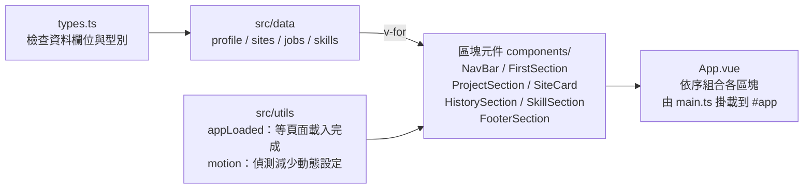

# 作品集網站技術實現說明

2026-10-05 · Kent

## 專案總覽

這是一個以 Vue 3 + TypeScript 打造的單頁式作品集網站，部署在 [kentfolio.dev](https://kentfolio.dev)。整頁由上到下分成六個區塊，每個區塊都是一個獨立的 Vue 元件。

| 區塊 | 元件 | 重點技術 |
| --- | --- | --- |
| 導覽列 | `NavBar.vue` | 固定置頂、IntersectionObserver 標示目前區塊 |
| 首頁 | `FirstSection.vue` + `HeroBackground.vue` | GSAP 打字動畫、Canvas 2D 粒子網路 |
| 精選作品 | `ProjectSection.vue` + `SiteCard.vue` | 資料驅動渲染、Tailwind 卡片 |
| 工作歷程 | `HistorySection.vue` | 捲動進度時間軸、展開收合 |
| 技術能力 | `SkillSection.vue` | Bento 排版、品牌圖示、GSAP 進場動畫 |
| 聯絡 / 頁尾 | `FooterSection.vue` | Three.js 三體物理模擬 |

使用的技術與用途：

| 技術 | 用途 |
| --- | --- |
| Vue 3（Composition API、`<script setup>`） | 畫面與元件 |
| TypeScript | 型別檢查，避免資料欄位打錯 |
| Vite | 開發伺服器與打包 |
| Tailwind CSS | 樣式（直接在 HTML 上寫 class） |
| GSAP | 文字打字動畫、卡片進場動畫 |
| Canvas 2D | 首頁粒子連線背景 |
| Three.js | 頁尾 3D 三體動畫 |
| Element Plus | 只用到「展開收合」的轉場元件 |
| simple-icons | Vue、TypeScript 等品牌圖示 |
| Vitest + Vue Test Utils | 單元與元件測試 |
| GitHub Actions + GitHub Pages | 自動測試、建置與部署 |

## 專案架構

核心觀念是「資料與畫面分開」：文字內容放在 `src/data/`，元件只負責把資料畫出來。要新增一筆工作經歷，只要在 `jobs.ts` 加一個物件，不用改任何元件。

```
src/
├─ main.ts            進入點：建立 Vue app 並掛到 #app
├─ App.vue            依序放入各區塊元件
├─ types.ts           資料的型別定義（Site、Job、SkillBlock…）
├─ components/        每個區塊一個元件，加上共用的小元件
├─ data/              個人資料、作品、工作經歷、技能
├─ utils/             共用工具函式
└─ assets/            圖片
```

幾個重要的設計：

- **型別先定義**：`types.ts` 定義 `Site`、`Job` 等介面，資料檔寫 `export const jobs: Job[]`。少寫欄位或拼錯，建置時就會報錯。
- **Props 用型別宣告**：`SiteCard.vue` 寫 `defineProps<Site>()`，卡片可接收的屬性就是 `Site` 的欄位。
- **個人資料集中管理**：名字、Email、GitHub 放在 `profile.ts`，導覽列、首頁、頁尾都從這裡取，改一次全站更新。
- **共用小元件**：`SectionHeader.vue` 統一各區塊標題樣式，`GithubIcon.vue` 是 GitHub 圖示。
- **工具函式**：`appLoaded.ts` 等頁面載入完成，`motion.ts` 判斷使用者是否要求減少動態效果。



資料檔由 `types.ts` 檢查型別，元件用 `v-for` 把資料畫成卡片，再由 `App.vue` 依序組成整頁。

## 頁面載入流程

頁面先顯示 Loading 畫面，等所有資源載完才淡入主內容，首頁打字動畫也等到這個時間點才開始，使用者不會錯過動畫。

1. `index.html` 裡有一個 `#app-loading` 區塊（旋轉圈），而 `#app` 一開始是 `opacity: 0`。
2. 瀏覽器觸發 `window` 的 `load` 事件（圖片、腳本都載完）後，把 Loading 淡出、`#app` 淡入。
3. 同時設定 `window.__appLoaded = true`，並發出自訂事件 `app-loaded`。
4. 元件呼叫 `whenAppLoaded()`，它回傳一個 Promise：已載入就馬上 resolve，否則等 `app-loaded` 事件。

```ts
export const whenAppLoaded = (): Promise<void> =>
  new Promise((resolve) => {
    if (window.__appLoaded) return resolve()
    window.addEventListener('app-loaded', () => resolve(), { once: true })
  })
```

為什麼需要兩種情況？因為元件掛載的時間可能在 `load` 之前或之後，先檢查旗標可以避免「事件已經發生過、從此等不到」的問題。頁尾也用它，在頁面載完後的閒置時間預先載入 three.js。

## 導覽列與捲動

導覽列用 `position: fixed` 固定在頂端，點選項目是一般的錨點連結（`href="#projects"`），不需要 JavaScript 就能跳過去。

- **平滑捲動**：全域 CSS 設 `scroll-behavior: smooth`。另設 `scroll-padding-top: 4rem`，跳到錨點時預留導覽列的高度，標題不會被蓋住。
- **捲動後加背景**：監聽 `scroll` 事件，`window.scrollY > 40` 時把導覽列從透明改為半透明白底 + `backdrop-blur`（毛玻璃）。
- **標示目前區塊**：用 `IntersectionObserver` 觀察各區塊，`rootMargin: '-50% 0px -50% 0px'` 把判斷範圍縮成畫面正中央一條線，哪個區塊覆蓋這條線，就是目前區塊。
- **手機選單**：一個 `menuOpen` 狀態控制 `v-show`，按鈕帶 `aria-expanded`，點選項目後自動收起。
- **回到頂部**：`BackToTop.vue` 在 `scrollY` 超過一個畫面高度時才顯示，連到 `#top`。

說明：`IntersectionObserver` 由瀏覽器在背景計算元素是否進入畫面，比每次 scroll 都去讀 `getBoundingClientRect()` 省效能。

## 首頁：打字動畫與粒子背景

首頁分成兩個元件：`FirstSection.vue` 負責文字與打字動畫，`HeroBackground.vue` 負責背景。

### 打字動畫（GSAP）

GSAP 的 `timeline` 像一條影片時間軸，把多個動畫依序串起來：頭像彈出、標題打字、名字打字、職稱淡入、描述打字，按鈕與描述同時出現。

- 打字效果來自 `TextPlugin`：`gsap.to(el, { text: 'Hello, 我是 ', duration: 0.6 })` 會逐字寫入文字。
- 位置參數 `'-=0.3'` 表示「提前 0.3 秒開始」，`'<'` 表示「與上一個動畫同時開始」，讓節奏更緊湊。
- 為了 SEO 與螢幕閱讀器，完整文字放在 `.sr-only`（畫面上看不到但存在於 HTML），打字用的元素加 `aria-hidden="true"`，避免被重複朗讀。
- 元件卸載時呼叫 `timeline.kill()` 與 `clearTimeout`，避免動畫在元件消失後繼續執行。

### 粒子連線背景（Canvas 2D）

背景由三層疊成：CSS 漸層與模糊色塊（極光）、CSS 格線、最上層是 `<canvas>` 畫的粒子網路。

1. **建立粒子**：依畫面面積決定數量（每 14000 平方像素一顆，限制在 30～90 顆），每顆有位置 `x, y` 與速度 `vx, vy`。
2. **每一幀移動**：位置加上「速度 × 經過時間」，碰到邊界就把速度反向（反彈）。用時間計算，120Hz 螢幕才不會跑得比 60Hz 快。
3. **畫連線**：兩兩比較距離，小於 130px 就畫一條線，越近越不透明。滑鼠也當成一個點，和 180px 內的粒子連線。
4. **中央變淡**：用「距離畫面中心多遠」計算一個倍率，越靠近文字區越淡，不干擾閱讀。
5. **動畫迴圈**：`requestAnimationFrame(animate)` 每一幀清除畫布、移動、重畫。

高解析度螢幕處理：canvas 的實際像素 = CSS 尺寸 × `devicePixelRatio`（最多 2），再用 `ctx.setTransform(dpr, …)` 縮放，繪圖時仍用 CSS 像素，線條就不會模糊。

極光色塊是三個 `blur-3xl` 的圓形 div，用 CSS `@keyframes` 緩慢位移與縮放，不佔用 JavaScript。

## 作品與技能區

兩個區塊都是「資料陣列 + `v-for`」：陣列有幾筆就畫幾張卡片。

```vue
<SiteCard
  v-for="site in sites"
  :key="site.link"
  :title="site.title"
  :description="site.description"
  :image="site.image"
  :link="site.link"
  :repo="site.repo"
  :techStack="site.techStack"
/>
```

- **key 的選擇**：`v-for` 用唯一值（作品用 `link`、經歷用 `company`）當 key，不用 index，Vue 更新時才不會對錯元素。測試也會檢查這些值不重複。
- **作品卡片**：`flex flex-col` + `h-full` 讓同一列卡片等高，按鈕區加 `mt-auto` 推到底部。有 `repo` 欄位才顯示「原始碼」按鈕（`v-if`）。外部連結加 `rel="noopener noreferrer"` 防止新分頁控制原頁面。
- **技能區 Bento 排版**：CSS Grid 三欄，前端與工具卡片加 `lg:col-span-2` 佔兩欄，形成「寬窄交錯」。
- **強調色**：資料只寫 `accent: 'indigo'`，元件裡用一張對照表轉成完整的 Tailwind class。必須寫成完整字串（如 `bg-indigo-50`），因為 Tailwind 是掃描原始碼找 class，用字串拼接的 class 會被漏掉。
- **品牌圖示**：`simple-icons` 套件提供每個品牌的 SVG path 與品牌色，只 import 用到的 6 個，打包時會 tree-shaking 去掉其他圖示。
- **進場動畫**：`IntersectionObserver` 發現卡片進入畫面，就用 GSAP 從 `opacity: 0, y: 24` 動到原位，並依卡片順序加延遲。播放後立即 `unobserve`，只播一次。

Tailwind 的觀念：不寫獨立的 CSS 檔，而是在元素上組合小 class（`rounded-2xl`、`shadow-sm`、`hover:-translate-y-1`）。`sm:`、`lg:` 前綴表示不同螢幕寬度才套用，這就是響應式設計。

## 工作歷程時間軸

時間軸中間有一條線，會隨著使用者往下捲而「填滿」顏色，經過的節點會亮起來。

**進度怎麼算**：取時間軸頂端與最後一張卡片底部的位置（`getBoundingClientRect()`），計算「已捲過的距離 ÷ 總距離」，結果限制在 0～1。區塊還沒進畫面是 0，完全捲過是 1。進度條的高度就是 `${progress * 100}%`。

**requestAnimationFrame 節流**：`scroll` 事件一秒可能觸發幾十次，每次都計算會浪費。做法是收到事件時若已經排了一幀就直接跳過，每幀最多計算一次：

```ts
let rafId: number | null = null
const handleScroll = () => {
  if (rafId) return               // 這一幀已經排過了
  rafId = requestAnimationFrame(() => {
    rafId = null
    updateProgress()
  })
}
window.addEventListener('scroll', handleScroll, { passive: true })
```

`passive: true` 告訴瀏覽器「這個監聽不會阻止捲動」，捲動更順。元件卸載時要 `removeEventListener` 與 `cancelAnimationFrame`，避免記憶體洩漏。

**展開收合**：用一個 `Set<number>` 記錄展開中的卡片 index，預設 `new Set([0])`（最新一筆展開）。「全部展開」是 `computed`：`expanded.size === jobs.length`。轉場動畫用 Element Plus 的 `<el-collapse-transition>`。狀態放在元件內而不是改原始資料，資料保持乾淨。

## 頁尾三體動畫

頁尾背景是用 Three.js 畫的三個星體，彼此用萬有引力互相吸引，軌道是「算」出來的，不是預先設定的路徑。

### Three.js 的三個基本物件

- **Scene（場景）**：放所有物體的容器。
- **Camera（相機）**：`PerspectiveCamera` 有遠近感。相機每幀繞著中心緩慢旋轉，再加上跟隨滑鼠的小位移（視差）。
- **Renderer（渲染器）**：`WebGLRenderer` 用 GPU 把場景畫到 canvas。

### 物理模擬

每一步對每一對星體計算引力（牛頓萬有引力定律）：

```
F = G × m1 × m2 / r²
```

接著用牛頓第二定律換算成加速度（a = F / m），再更新速度與位置：速度 += 加速度 × dt，位置 += 速度 × dt。這種一步一步往前推的方法叫「數值積分」。另外加了邊界反彈與向心力，避免星體飛出畫面。

### 固定時間步長

如果「每幀算一步」，120Hz 螢幕的星體會跑得比 60Hz 快一倍。做法是累積實際經過的時間，每滿 1/60 秒才算一步：

```ts
accumulator += Math.min(now - lastTime, 100) // 最多補 100ms
while (accumulator >= STEP_MS) {
  stepBodies()
  accumulator -= STEP_MS
}
```

上限 100ms 是為了切換分頁回來時，不會一次補算幾千步導致卡頓。

### 視覺細節

- **光暈**：用 canvas 畫一張放射漸層貼圖，貼在 `Sprite`（永遠面向相機的平面）上，配合 `AdditiveBlending`（顏色相加）產生發光。
- **軌跡**：每個星體保留最近 400 個位置，存在預先配置好的 `Float32Array`，滿了就用 `copyWithin` 整段前移，不每幀建立新陣列。每個點帶 RGBA 顏色，越舊的點 alpha 越低，形成淡出。
- **星空**：兩層 `Points`（大量小星 + 少量亮星），用球面座標均勻分佈，緩慢自轉。
- **桌機版右移**：`camera.setViewOffset()` 讓畫面中心往右偏，左側留給文字。

## 效能優化

主要策略是「不需要的東西不載、看不到的動畫不跑」。

| 優化 | 做法 | 效果 |
| --- | --- | --- |
| three.js 延後載入 | `import('three')` 動態載入，Vite 會拆成獨立檔案 | 約 700 KB 的 three.js 不影響首屏載入 |
| 閒置時預載 | 頁面載完後用 `requestIdleCallback` 載入 three.js | 捲到頁尾時已經準備好 |
| 看不到就暫停 | `IntersectionObserver` 監控首頁與頁尾，離開畫面就 `cancelAnimationFrame` | 不浪費 CPU / GPU、省電 |
| 捲動節流 | `requestAnimationFrame` 每幀最多算一次 | 捲動不卡頓 |
| 重複使用物件 | Three.js 的暫存向量、軌跡 buffer 都預先建好 | 減少垃圾回收造成的卡頓 |
| 高 DPI 上限 | `devicePixelRatio` 最多用 2 | 3 倍螢幕的手機不會畫 9 倍像素 |
| 按需引入 | Element Plus 只 import 用到的元件；simple-icons 只 import 6 個圖示 | tree-shaking 去掉沒用到的程式碼 |
| 圖片 | 改用 WebP，圖片加 `loading="lazy"` | 檔案更小，捲到才載入 |
| 釋放資源 | 卸載時對幾何體、材質、貼圖呼叫 `dispose()` | 避免 WebGL 記憶體洩漏 |

補充：tree-shaking 是打包工具分析「哪些 export 有被用到」，沒用到的就不打包進去，前提是用 `import { x } from '...'` 這種具名引入。

## 無障礙與 SEO

動畫很多的網站，要確保「不喜歡動畫的人、看不到畫面的人、搜尋引擎」都能正常使用。

- **減少動態效果**：使用者在系統開啟「減少動態」時，`matchMedia('(prefers-reduced-motion: reduce)')` 會是 true。此時首頁直接顯示完整文字、粒子與三體只畫一張靜態畫面、技能卡不播進場動畫，全域 CSS 也把 transition 與 animation 時間設為幾乎 0。
- **螢幕閱讀器**：打字文字用 `.sr-only` 提供完整版本；裝飾用的背景、圖示加 `aria-hidden="true"`；只有圖示的連結加 `aria-label`（例如 "GitHub"、"回到頂部"）。
- **狀態告知**：展開按鈕與手機選單按鈕帶 `aria-expanded`，導覽列目前項目帶 `aria-current`。
- **語意化標籤**：`<header>`、`<nav>`、`<section>`、`<footer>`、`<article>`、`<dl>`，讓結構可以被機器理解。
- **觸控裝置**：Tailwind 設 `hoverOnlyWhenSupported`，手機點擊後不會卡在 hover 樣式。
- **SEO**：`<html lang="zh-Hant">`、`<title>`、`<meta name="description">`、Open Graph 標籤（分享到社群時的標題與描述）。

## 測試

專案有 73 個測試，用 Vitest 執行，Vue Test Utils 負責掛載元件、點擊按鈕、檢查畫面文字。測試環境是 jsdom（在 Node.js 裡模擬瀏覽器 DOM）。

測試內容分三類：

- **資料檢查**：每筆作品、經歷、技能欄位完整；當 key 的值不重複；經歷依時間由新到舊。
- **元件行為**：展開收合、手機選單開關、導覽列捲動後變色、連結帶 `noopener`。
- **動畫邏輯**：離開畫面會暫停、減少動態時不播放、三體模擬以固定步長進行、卸載時有釋放資源與移除監聽。

jsdom 沒有 Canvas、WebGL、IntersectionObserver，所以在 `tests/setup.js` 補上假的版本（mock）：

| 瀏覽器 API | Mock 方式 |
| --- | --- |
| `IntersectionObserver` | 記錄被觀察的元素，測試可手動呼叫 `trigger(true)` 模擬進入畫面 |
| `requestAnimationFrame` | 不自動執行，放進佇列，測試呼叫 `flushFrame(time)` 精準控制每一幀的時間 |
| Canvas 2D context | 每個方法都是 `vi.fn()`，可以檢查「畫了幾個圓」 |
| three.js | 用真的 three.js 計算物理，只把需要 WebGL 的 `WebGLRenderer` 換成假的 |
| GSAP | 換成只記錄呼叫參數的假物件，檢查動畫設定是否正確 |

例如「120Hz 螢幕不會變快」的測試：用 `flushFrame` 以半個步長的間隔跑 20 幀，檢查軌跡剛好只有 10 個點。

## TypeScript 與 CI/CD

每次 push 到 `master`，GitHub Actions 會自動測試、型別檢查、建置，全部通過才部署，任何一步失敗網站就維持舊版。

**TypeScript**：瀏覽器只看得懂 JavaScript，Vite 開發時只會把型別拿掉不檢查。真正的檢查由 `vue-tsc --noEmit` 負責，它看得懂 `.vue` 檔。`npm run build` 會先跑它再打包。`tsconfig.json` 開啟嚴格模式（禁止隱含 `any`、檢查 null）。

CI 流程（`.github/workflows/ci.yml`）：

1. `actions/checkout` 取得程式碼，`actions/setup-node` 安裝 Node 22。
2. `npm ci` 依 lockfile 安裝套件，確保和本機版本一致。
3. `npm test` 跑所有測試。
4. `npm run build` 型別檢查 + 打包到 `dist/`。
5. `peaceiris/actions-gh-pages` 把 `dist/` 推到另一個 repo `portfolio-dist`，由 GitHub Pages 發布。

小細節：

- `public/CNAME` 寫著 `kentfolio.dev`，打包時會複製到 `dist/`，GitHub Pages 靠它綁定自訂網域。
- `keep_files: true` 保留 `portfolio-dist` 裡其他作品的資料夾（例如 `fishing-reel/`），只覆蓋作品集本身的檔案。
- 部署用 Deploy Key（存在 repo secret），只有寫入 `portfolio-dist` 的權限。
- Pull request 只跑測試與建置，不部署。

## 常見問答

**Q：為什麼用 Composition API 而不是 Options API？**
相關邏輯可以寫在一起（例如動畫的狀態、啟動、清理放在同一段），配合 TypeScript 型別推斷也更好。`<script setup>` 讓寫法更簡潔。

**Q：ref 和 reactive 的差別？你怎麼用？**
`ref` 可以包任何值，讀寫要 `.value`；`reactive` 只能包物件。專案要讓畫面跟著更新的狀態用 `ref`（如 `scrollProgress`、`menuOpen`）；動畫內部的變數（粒子位置、Three.js 物件）刻意用普通變數，因為每幀改動不需要觸發 Vue 重新渲染。

**Q：動畫會不會影響效能？**
三個做法：離開畫面就暫停（IntersectionObserver）、three.js 延後載入、捲動事件用 requestAnimationFrame 節流。動畫也以時間而不是幀數計算，不同更新率螢幕速度一致。

**Q：元件卸載時要注意什麼？**
在 `onUnmounted` 移除事件監聽、取消 `requestAnimationFrame` 與計時器、中斷 Observer、結束 GSAP 動畫、對 Three.js 物件呼叫 `dispose()`。否則會記憶體洩漏，或對已經不存在的元素操作而報錯。

**Q：Canvas 2D 和 WebGL（Three.js）怎麼選？**
首頁是幾十個點與線的 2D 畫面，Canvas 2D 就夠且不用載入套件；頁尾需要 3D 透視、相機旋轉與發光混色，用 Three.js 封裝的 WebGL 比較合適。

**Q：Tailwind 的優缺點？**
優點是不用想 class 名稱、樣式跟著元件走、打包只留用到的 class。缺點是 HTML 較長，而且 class 不能用字串拼接（掃描不到），專案用「完整 class 對照表」解決。

**Q：怎麼測試動畫？**
把 `requestAnimationFrame` 換成手動控制的佇列，測試自己決定每一幀的時間，就能驗證「經過多少時間該走幾步」這類邏輯。

**Q：這個專案是怎麼開發的？**
建議誠實說明使用 AI 輔助開發，重點放在你做的決策：需求與設計方向、驗證成果（測試、實機檢查）、以及讀懂並能說明每個實作，就是這份文件的內容。
